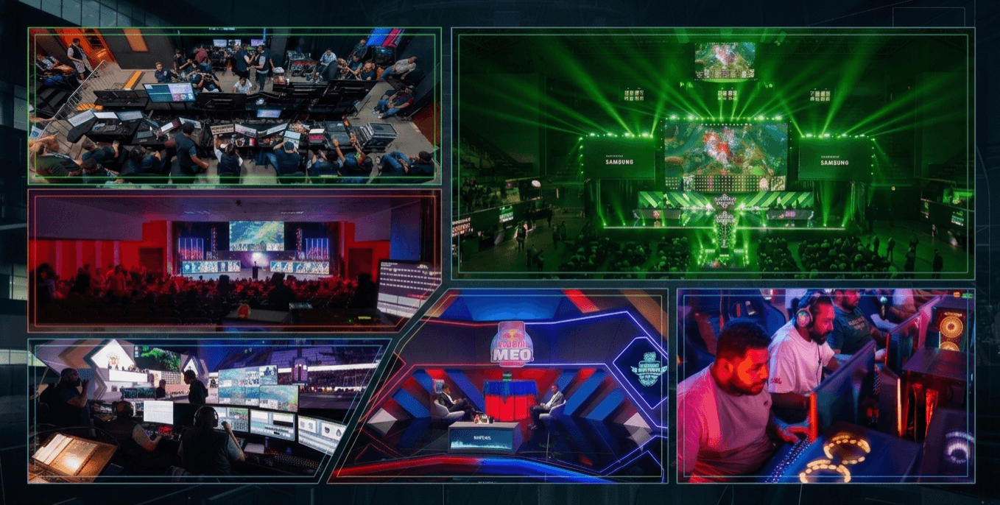
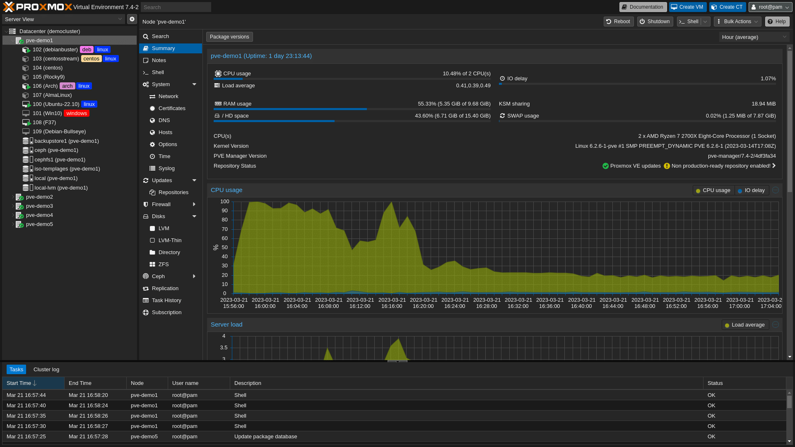
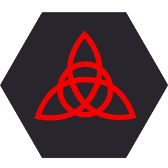
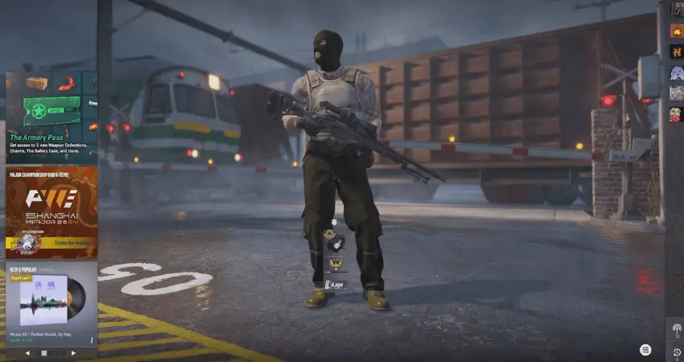
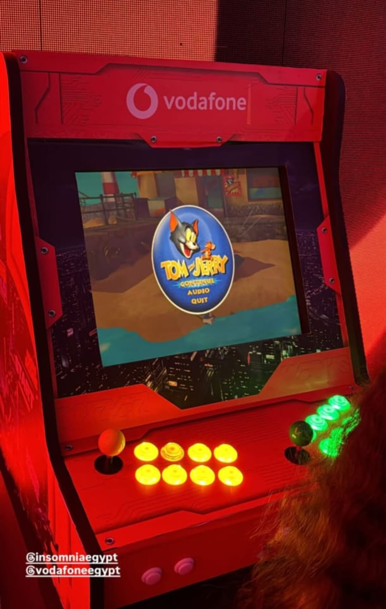

---
hide:
  - navigation
---

# Projects

## **Esports Events**

I've had the opportunity to manage network and internet infrastructure for multiple large-scale esports and gaming events, including Esports Summit (ESS), Red Bull Login, IAC Final 2022, and others.

Across these events, I was typically responsible for:

- Designing and deploying LAN topology connecting gaming PCs, consoles, and production systems
- Configuring VLANs to segment and secure player, production, and public networks
- Managing firewalls, bandwidth allocation, and load balancing to ensure stable and secure connectivity
- Setting up and optimizing Wi-Fi access points for full venue coverage
- Monitoring network performance in real time to maintain low latency during matches

##  **Proxmox Home Lab**

Having a place to test whatever comes to mind is genuinely useful, so I repurposed an old PC and installed Proxmox VE on it as a self-hosting playground. It lets me spin up virtual machines or LXC containers on demand, and TurnKey Linux offers a solid library of pre-configured container templates that make deploying new services fast rather than starting from a blank OS every time.

##  **Self-Hosted Password Manager (Bitwarden)**

Bitwarden is a strong open-source password manager that supports 2FA and can run entirely offline if needed. It also supports organizations, so credentials — including 2FA-protected ones — can be shared securely between employees rather than passed around insecurely.

I'd never used a password manager before this, mainly because I didn't want to trust a large third-party company with my credentials regardless of their privacy claims. Once I realized Bitwarden could be self-hosted, keeping full control of the data, I gave it a try — and it's been part of my setup since.

##  **Virtualized Firewall (pfSense on Proxmox)**

If you don't have a dedicated hardware firewall, pfSense can be run as a virtual machine instead, with network interface cards virtualized alongside it. I also added DNS-based ad-blocking within the firewall layer, filtering ads by blocking known ad domains and IP ranges at the network level rather than relying on browser extensions.

##  **Internet Quota Monitoring Script**

Manually checking quota usage across multiple internet lines every day gets tedious fast, so I automated it. This Python script logs into the [te.eg](https://te.eg) portal, checks remaining data and days left until renewal for each line, and can be scheduled via task scheduler to run automatically — sending a daily WhatsApp report so I never have to check manually.

Check it out on [GitHub](https://github.com/AbanoubEhab/we_qouta_checker_Egypt).

##  **LanCache Server Deployment**

At esports events — or anywhere with many computers needing to download the same large files or game updates — available bandwidth often can't keep up with demand. LanCache solves this efficiently:

- Set it as the primary DNS server (via DHCP)
- It intercepts HTTP download requests and caches the content locally
- Subsequent computers requesting the same files are served locally instead of re-downloading from the internet

This approach saved terabytes of bandwidth across 100+ computers during live events.

##  **CS2 Game Server**

Deployed a CS2 game server using Docker inside an LXC container with persistent storage mounting, built for Esports Summit tournament infrastructure. Achieved ~7ms latency across Cairo during testing; planned site-to-site VPN access for the event before the tournament was cancelled.

## :simple-applearcade: **Linux Arcade Machine**

I built the electronics and internal systems for a fully functional arcade machine, integrating the wiring, controls, and display into a cabinet. The system runs on an Intel i5 4th generation CPU with integrated graphics, handling a curated library of retro games spanning NES, SNES, PS1, PS2, and Nintendo DS emulation. For the software, I used Batocera, a Linux-based retro-gaming distribution, configuring the system for proper controller mapping and a smooth boot-to-play experience.

