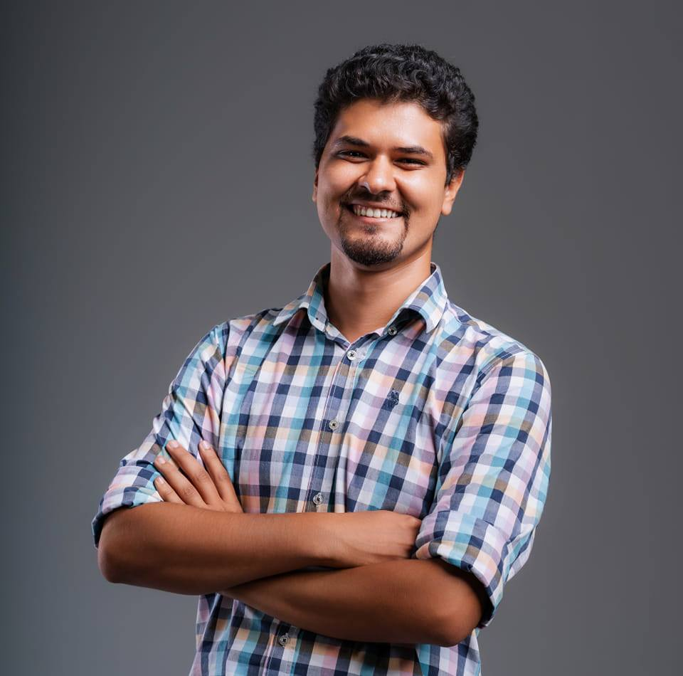

# Abanoub Ehab Malak

**Personal Information:**

- **Phone:** 01208147368
- **Email:** [abanobehab@gmail.com](mailto:abanobehab@gmail.com)
- **LinkedIn:** [linkedin.com/in/abanoubehabmalak](http://linkedin.com/in/abanoubehabmalak)
- **GitHub:** [github.com/AbanoubEhab](http://github.com/AbanoubEhab)
- **Date of Birth:** 13 January 1997
- **Military Status:** Exempted
- **Address:** Ezbet Alnakel, Marg

---

## **Education**

**Bachelor of Commerce (Accounting)**  
*Ain Shams University* — **2020**  
65.15% (Good)

---

## **Courses**

- Cisco Certified Network Associate (**CCNA**)
- Microsoft Certified Solutions Associate (**MCSA**)
- Red Hat Linux Administrator I (**RHCSA**)

---

## **Technical Skills**

- **Virtualization:** Proxmox, Virtual Machines, LXC Containers
- **Containerization:** Docker, Docker Compose
- **Security:** Sophos Firewall (maintenance, updates, patches, policy management)
- **ERP Administration:** Frappe ERP System
- **Programming Languages:** Python (Scripting)
- **Networking:** CCNA (DNS, DHCP, TCP/IP, VLANs)
- **Operating Systems:** Linux (Ubuntu, Debian, Fedora, RedHat)
- **Hardware & Peripherals:** Photocopier and Printer Maintenance (Canon)

---

## **Languages**

- **English:** Very Good

---

## **Professional Experience**

### **IT Specialist**

*Gamers Lounge* — *June 2022 – Present*

- Managed and maintained **Proxmox** and **Linux servers** for optimal performance and uptime.
- Configured, updated, and maintained **Sophos firewall**, ensuring network security and compliance.
- Troubleshot network issues, including **DNS**, **DHCP**, and hardware/software failures.
- Administered **Frappe ERP system**, handling installation, configuration, and system management.
- Optimized system performance and resource utilization through monitoring and adjustments.
- Collaborated with IT team members on system design and technology implementation for business operations.

### **Technician: Photocopiers and Printers**

*Canotech* — *May 2018 – June 2022*

- Installed, configured, and maintained **Canon** photocopiers for clients.
- Diagnosed and repaired issues such as paper jams, toner problems, and hardware malfunctions.
- Managed driver installations and trained users on troubleshooting procedures.

### **Call Center Agent**

*IMI (Orange)* — *May 2017 – Oct 2017*

- Provided customer support for billing, service requests, and technical issues.
- Resolved complaints and disputes, ensuring customer satisfaction and efficient service delivery.
- Documented interactions in the CRM system and stayed updated on products and services through ongoing training.

---

## **Other Skills**

- Quick learner with adaptability to new technologies.
- Strong problem-solving and analytical thinking.
- Excellent communication and team collaboration skills, with the ability to work independently when required.

---

[Download as PDF](assets/AbanoubEhabMalak.pdf){: download="AbanoubEhabMalak.pdf" .md-button}

